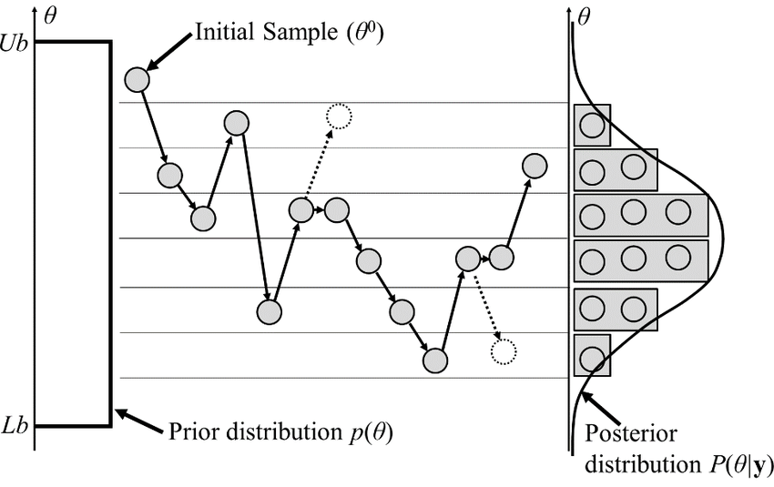

# The Metropolis-Hastings algorithm

The Metropolis-Hastings algorithm is a Markov chain Monte Carlo method used to acquire a sequence of random samples from a probability distribution 
where direct sampling is difficult. This sequence can be used to compute an integral or to estimate the distribution.

[More details about the algorithm](https://en.wikipedia.org/wiki/Metropolis–Hastings_algorithm)
[A video to further understand the algorithm](https://www.youtube.com/watch?v=0lpT-yveuIA)

## Code Overview

We will explore three different probability density functions, the first is 2-dim and bimodal, the other two are 10-dim and unimodal MVNs
